# NexusSense

A lightweight .NET 10 Windows app that displays MSI Afterburner sensor data on the **Corsair iCUE Nexus Companion** touch screen.

Sensors, layout, colors and LED bar style are fully configurable via a JSON file — no recompile needed. Config changes are picked up live without restarting.

### Styles

| | | | |
|---|---|---|---|
| 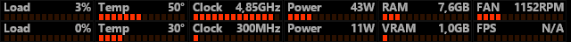 | 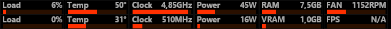 | 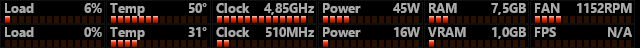 | 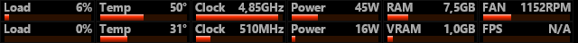 |
| 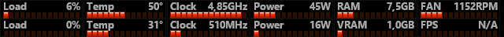 | 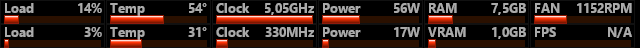 | 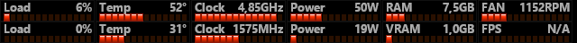 | 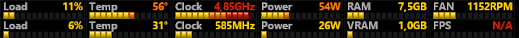 |

| | |
|---|---|
| 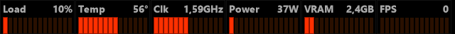 | 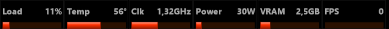 |
| 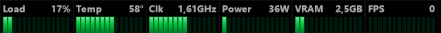 | 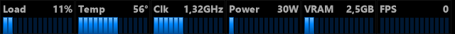 |

---

## Requirements

- [MSI Afterburner](https://www.msi.com/Landing/afterburner) (must be running)
- Corsair iCUE Nexus Companion (USB HID, VID `0x1b1c` / PID `0x1b8e`)
- `hidapi.dll` — included in the repo (x64 Windows build from [libusb/hidapi](https://github.com/libusb/hidapi/releases))
- Windows 10/11 with [.NET 10 runtime](https://dotnet.microsoft.com/en-us/download/dotnet/10.0)

---

## Build

```
dotnet build NexusSense.csproj
```

---

## Usage

Double-click `NexusSense.exe` to start. The app hides the console window and runs as a **system tray** application. Right-click the tray icon → **Exit** to quit.

```
NexusSense.exe            Start (minimizes to system tray)
NexusSense.exe -d         Start with debug console visible
NexusSense.exe -s         List all available Afterburner sensor names and IDs, then exit
NexusSense.exe -h         Show help and exit

Long forms: --debug, --sensors, --help
```

> **Tip:** run with `-s` / `--sensors` first to see every sensor name exposed by Afterburner. Use those exact strings in `SensorName` fields of the config.

---

## Configuration

Edit `nexus_config.json` next to the exe. Changes are detected by file-modification time and applied on the next render cycle — no restart needed.

If the file is missing on first launch, a default config with six common sensors is generated automatically.

### Top-level fields

| Field | Default | Description |
|---|---|---|
| `IntervalMs` | `500` | Sensor poll and render interval in milliseconds |
| `Brightness` | `100` | LCD brightness 0–100 |
| `Font` | `C:\Windows\Fonts\segoeui.ttf` | Path to a `.ttf` file for regular text |
| `BoldFont` | `C:\Windows\Fonts\segoeuib.ttf` | Path to a `.ttf` file used when `LabelBold`/`ValueBold` is true |
| `PageNavigation` | `"both"` | Touch gesture mode (see below) |
| `TapZoneWidth` | `128` | Width in pixels of the left/right tap zones |
| `Pages` | `[]` | Array of page configs, each with its own items and visual settings |

### Page navigation

| `PageNavigation` | Behavior |
|---|---|
| `"both"` | Swipe left/right **or** tap edge zones |
| `"swipe"` | Swipe only |
| `"tap"` | Tap left/right edge zones only |

- Swipe **right** (`->`) or tap the **left** edge zone → previous page
- Swipe **left** (`<-`) or tap the **right** edge zone → next page

`TapZoneWidth` sets the width in pixels of each tap zone (default `128` = 20% of the 640 px display).

### Per-page visual settings

Each entry in `Pages` has a `Page` index (0, 1, 2, …) and the following optional style fields. Any omitted field falls back to the listed default.

| Field | Default | Description |
|---|---|---|
| `Background` | `"#000000"` | Background fill color |
| `LabelColor` | `"#aaaaaa"` | Label text color |
| `ValueColor` | `"#aaaaaa"` | Value text color (when `DynamicColor` is not `"value"` or `"both"`) |
| `PanelBorder` | `"#111111"` | Border color drawn around each sensor panel |
| `LedColor` | `"#ff3000"` | LED bar color (when `DynamicColor` is not `"graph"` or `"both"`) |
| `LedOffColor` | `"#1a1a1a"` | Unlit LED color |
| `LedCount` | `14` | Number of LED segments per bar |
| `LedWidth` | `5` | Width of each LED segment in pixels |
| `LedGap` | `2` | Gap between segments in pixels (segments style only) |
| `LedHeight` | `7` | Height of the LED bar in pixels |
| `LedStyle` | `"bar"` | `"bar"` for a continuous bar, `"segments"` for individual blocks |
| `LedGlow` | `false` | Adds a soft glow halo around lit LEDs |
| `LedHighlight` | `false` | Adds a white highlight strip along the top of lit LEDs |
| `LedGradientTop` | `0.0` | Lighten amount at the top of each LED (0–1) |
| `LedGradientMid` | `0.0` | Midpoint of the top→color gradient (0–1) |
| `LedGradientBottom` | `0.0` | Darken amount at the bottom of each LED (0–1) |
| `Items` | `[]` | Array of sensor panels on this page |

### Auto layout

Panels are arranged automatically:

- **≤ 6 items** → single row of 48 px tall panels
- **> 6 items** → two rows of 24 px tall panels

Columns are distributed evenly across the 640 px display width.

### Sensor item fields

| Field | Default | Description |
|---|---|---|
| `SensorName` | `""` | Afterburner sensor name (e.g. `"GPU temperature"`). **Takes priority** over `SensorId` when both are set. Use `-s` to list all names. |
| `SensorId` | `null` | Zero-based sensor index. Fallback when `SensorName` is empty. |
| `Label` | `""` | Short text shown on the panel |
| `Format` | `"{0:F0}"` | .NET composite format string; `{0}` is the sensor value after `Divisor` is applied |
| `GraphMin` | `0` | Sensor value that maps to 0 % of the LED bar |
| `GraphMax` | `100` | Sensor value that maps to 100 % of the LED bar. Values above this are shown as `N/A`. |
| `Divisor` | `1` | Divide raw value before display (e.g. `1024` to convert MB → GB) |
| `DynamicColor` | `"none"` | Which elements respond to `ColorRanges` (see below) |
| `ColorRanges` | `[]` | List of `{ "UpTo": N, "Color": "#rrggbb", "OffColor": "#rrggbb" }` thresholds |
| `ValueSize` | `10` | Font size for the value text |
| `LabelSize` | `9` | Font size for the label text |
| `LabelBold` | `false` | Render label with `BoldFont` |
| `ValueBold` | `false` | Render value with `BoldFont` |
| `LabelX` / `LabelY` | `2` / `1` | Label position relative to panel top-left |
| `ValueX` / `ValueY` | `104` / `1` | Value right-edge X and top Y relative to panel |
| `GraphX` / `GraphY` | `0` / `16` | LED bar left edge X and **bottom** edge Y relative to panel |

### DynamicColor

| Value | Effect |
|---|---|
| `"none"` | Fixed colors from `LedColor` / `ValueColor` |
| `"value"` | Value text changes color based on `ColorRanges` |
| `"graph"` | LED bar changes color based on `ColorRanges` |
| `"both"` | Both value text and LED bar change color |

### ColorRanges

Thresholds are evaluated in ascending `UpTo` order; the first range whose `UpTo` ≥ current value wins.

```json
"ColorRanges": [
  { "UpTo": 60,  "Color": "#00cc44", "OffColor": "#002210" },
  { "UpTo": 80,  "Color": "#ffcc00", "OffColor": "#1a1200" },
  { "UpTo": 100, "Color": "#cc2200", "OffColor": "#1a0400" }
]
```

---

## Credits

HID communication, LCD image upload protocol and touch/swipe detection are based on
[NexusTool](https://github.com/willneedit/NexusTool) by **willneedit**

---

## License

MIT
